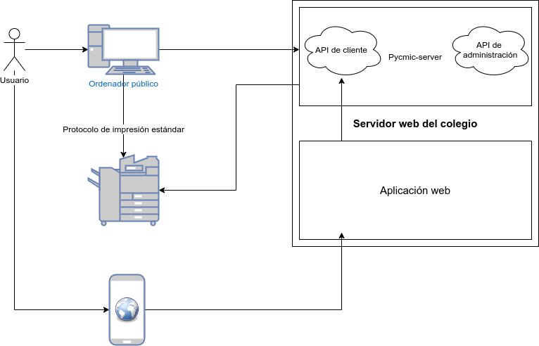

# Pycmic-server - Necesidades y casos de uso

## Estado actual

En el CM Isabel la Católica existe un servicio de reprografía a disposición de los colegiales. Este servicio funciona mediante la recarga de "pasos" de impresión. Este número de pasos está vinculado a un código de usuario generado para cada colegial (al estilo de una tarjeta prepago). El número de pasos restantes solo podía ser consultado por la administración, por lo que los colegiales se quedaban sin pasos cuando más lo necesitaban y sin posibilidad de recargar más (la administración solo está abierta en horario de oficina por las mañanas). Además solo se podía imprimir desde una memoria USB en el propio panel de la impresora, lo que causa problemas de formatos de archivo y tipos de letra incompatibles. Para solventar esto se puso en marcha un ordenador público que necesitaba acceder al sistema de la impresora para conocer los usuarios que existen y poder autenticarlo. Para ello se diseñó una aplicación que permite introducir el código de usuario y, en caso de que exista, permite imprimir. Además se muestra el número de pasos restantes en la ventana principal de la aplicación, por lo que en principio ambos problemas quedan resueltos.

Sin embargo, debido a las características del ordenador el sistema falla en numerosas ocasiones debido a cuelgues del sistema o de la propia impresora, por lo que la experiencia de uso deja bastante que desear (si funciona bien la gente no tiene problema, pero al fallar se desesperan y optan por no imprimir o acudir a una tienda externa). Además, debido a un cuello de botella en el procesador del ordenador muchos trabajos de impresión *complejos* tardan mucho tiempo desde que son enviados hasta que realmente se imprimen debido al procesamiento en el ordenador de los archivos PDF. 

Con respecto a la impresora, el sistema está configurado para que pregunte por los nuevos contadores de usuario cada 5 minutos, esto junto con los cuelgues constantes del sistema hace que casi siempre se queden peticiones a mitad, que saturan el sistema de la impresora y hace que tenga que reiniciarse manualmente. Además hay un problema de seguridad ya que las credenciales de administración de la impresora están almacenados en el propio ordenador que, al ser público, permitirían a un supuesto usuario malintencionado conseguir dichas credenciales y obtener permisos de administración, pudiendo aumentar su propio contador de pasos sin pasar por la administración y realizar el pago de los mismos.

Por todo esto, se quiere externalizar el servicio de consulta de pasos e instalarlo en el servidor web del colegio, máquina protegida y confiable que mantendría el registro de los usuarios que han impreso así como las credenciales de administración de la máquina de impresión. Para poder hacer estas tareas se ha pensado crear un microservicio web cuya finalidad es servir como servidor de información al ordenador público, transmitiéndole únicamente los datos necesarios para que cada usuario pueda imprimir. Además se quiere llevar un registro de cuando imprimen los usuarios para evitar así posibles fraudes y suplantaciones de identidad.

## Casos de uso

### Caso de uso 1: Usuario normal

1. El usuario introduce su código en el ordenador público.
2. El ordenador se conecta al microservicio para comprobar si dicho usuario existe.
3. En caso de existir, consulta el número de pasos restantes y su última conexión, lo muestra en pantalla y se configura para imprimir con el código de usuario.
4. En caso de no existir muestra un mensaje de error al usuario pidiéndole que vuelva a introducir su código.

### Caso de uso 2: Usuario administrador del sistema

- El administrador pide al servidor estadísticas sobre la comunicación con la impresora, así como el número de autenticaciones válidas y fallidas en el sistema.

- El administrador puede forzar la actualización de la información con respecto a la base de datos de la impresora.

### Caso de uso 3: Administración del Colegio

1. La dirección del colegio solicita al servidor un informe de las impresiones realizadas.

## Diseño del microservicio

El servicio consistirá en un microservicio web programado en Python usando el framework Flask que expondrá una API para la consulta desde la aplicación de escritorio del ordenador público y/o la aplicación web del colegio (para permitir a los colegiales conocer sus pasos sin necesidad de ir al ordenador público). El esquema del servicio será el siguiente:

