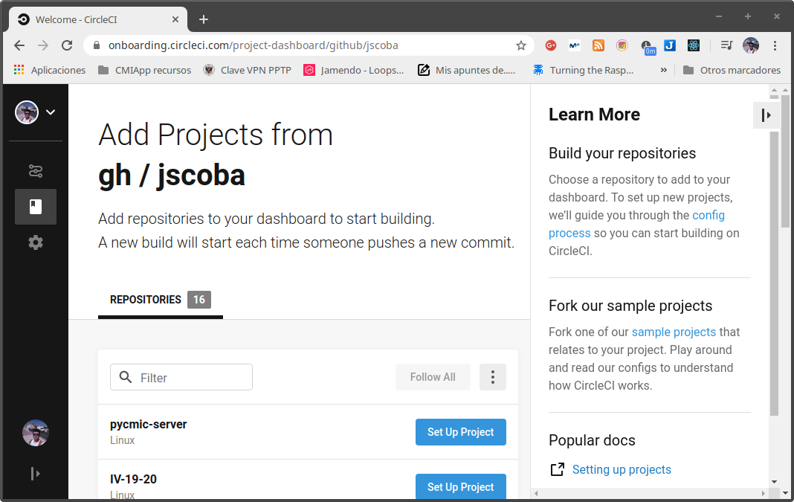

# Pycmic-server - Documentación Hito 2

Vamos a configurar los sistemas de integración contínua. Las herramientas a configurar son Travis y CircleCI.

Como ya tenemos configurada la herramienta Make para instalar y ejecutar nuestra aplicación y los tests se facilita mucho la tarea, por lo que solo tenemos que decirle a la plataforma de integración como usarla y make hará el resto.

## Configuración de Travis

Para configurar travis tenemos que crear un archivo .travis.yml en la raiz de nuestro proyecto con la configuración necesaria:

`.travis.yml`

```yml
language: python
python:
  - "3.8"

install:
  - make install_dependencies

script:
  - make test

```

Una vez tenemos el archivo de configuración en nuestro repo, solo nos falta activar el repositorio desde nuestro perfil de Travis.


Una vez que tenemos nuestro repositorio configurado podemos incluir en el README la imagen dinámica que muestra el estado de los tests de nuestra aplicación

[](https://travis-ci.org/jscoba/pycmic-server) 

## Configuración de CircleCI

Para configurar CircleCI nos vamos a la configuración de CircleCI y elegimos la opción de añadir proyecto



Esto nos da un fichero de configuración por defecto sobre el que trabajar. En nuestro caso cambiamos la versión de python por defecto y le decimos a la herramienta que utilice make para instalar la aplicación y ejecutar los tests.


`.circleci/config.yml`

```yml
# Python CircleCI 2.0 configuration file
#
# Check https://circleci.com/docs/2.0/language-python/ for more details
#
version: 2
jobs:
  build:
    docker:
      # specify the version you desire here
      # use `-browsers` prefix for selenium tests, e.g. `3.6.1-browsers`
      - image: circleci/python:3.8.1

      # Specify service dependencies here if necessary
      # CircleCI maintains a library of pre-built images
      # documented at https://circleci.com/docs/2.0/circleci-images/
      # - image: circleci/postgres:9.4

    working_directory: ~/repo

    steps:
      - checkout

      # Download and cache dependencies
      - restore_cache:
          keys:
            - v1-dependencies-{{ checksum "requirements.txt" }}
            # fallback to using the latest cache if no exact match is found
            - v1-dependencies-

      - run:
          name: install dependencies
          command: |
            python3 -m venv venv
            . venv/bin/activate
            make install_dependencies

      - save_cache:
          paths:
            - ./venv
          key: v1-dependencies-{{ checksum "requirements.txt" }}

      # run tests!
      # this example uses Django's built-in test-runner
      # other common Python testing frameworks include pytest and nose
      # https://pytest.org
      # https://nose.readthedocs.io
      - run:
          name: run tests
          command: |
            . venv/bin/activate
            make test

      - store_artifacts:
          path: test-reports
          destination: test-reports
```

Con esto ya tenemos listo el proyecto para ejecutar los tests con CircleCI y ya podemos añadir la imagen de estado. [](https://circleci.com/gh/jscoba/pycmic-server)

