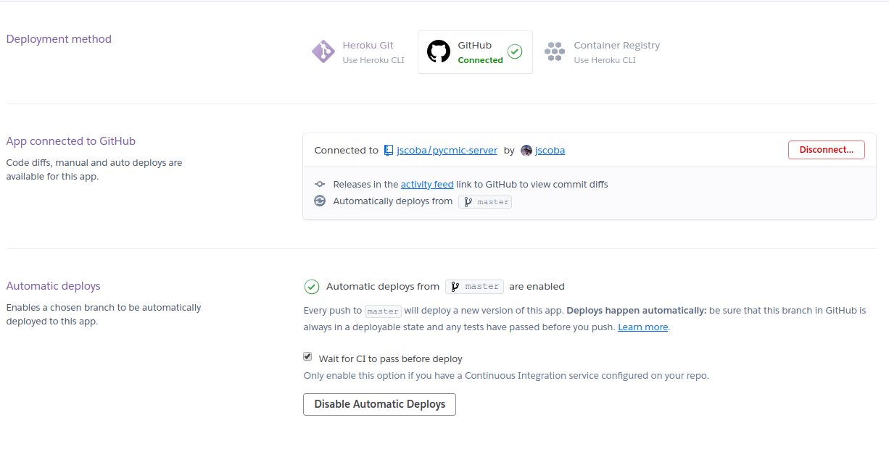

# Pycmic-server - Despliegue de la aplicación en Heroku

A la hora de elegir un PaaS tras ver varias opciones como Google App Engine que no me convencían lo suficiente opté por Heroku.

Para poder desplegar la aplicación sin contaneirizar se creó un archivo Procfile en la raiz del repositorio donde se indica la orden a ejecutar de nuestra herramienta gestora de tareas (make) usada para arrancar la aplicación.

Como el servidor integrado de Flask solo está recomendado para el desarrollo y no para ser usado en producción, se ha instalado `gunicorn`, un servidor de aplicaciones Python que sí está preparado para usarse como servidor de producción y servir muchas peticiones de forma simultánea. En el Makefile se ha creado un nuevo objetivo llamado `start_heroku` que arranca la aplicación con `gunicorn`.

Por esto el `Procfile` ha quedado tal que así

```yml
web: make install && make start_heroku #Iniciar la bd y ejecutar la app
```


Una vez estaban ambos archivos creados desde el cli de Heroku se ejecutaron los siguientes comandos:
```bash
heroku apps:create pycmic-server # Crear la aplicación en nuestra cuenta de Heroku
git push heroku master # Subir el repositorio a Heroku para crear la imagen de la aplicación
```

Tras ejecutar estos comandos ya estaba funcionando la aplicación sobre la Plataforma de Heroku

Además desde la interfaz web de Heroku hemos configurado que se haga un nuevo deploy de la aplicación cuando se haga una actualización de la rama `master` del repositorio en GitHub y hayan pasado los tests de Travis

