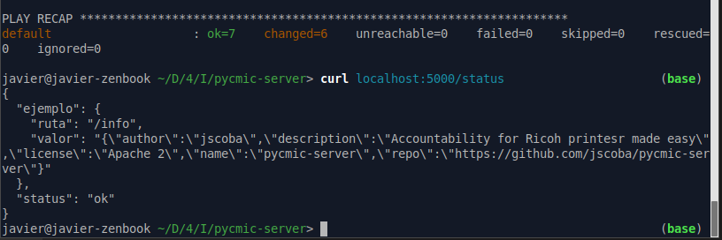
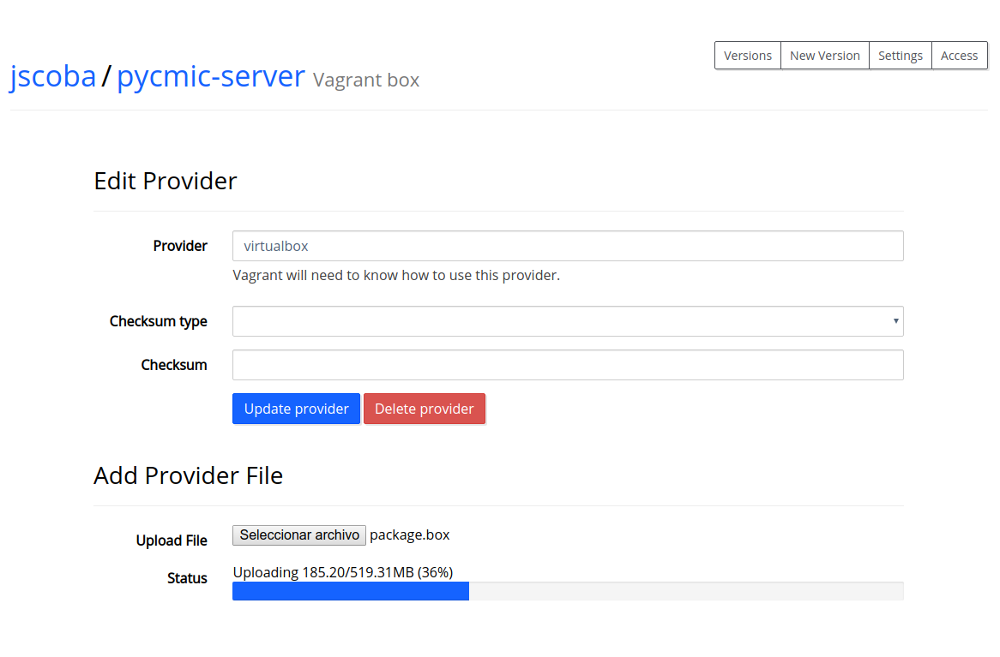
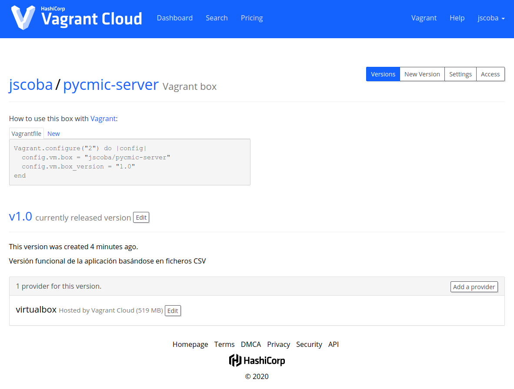
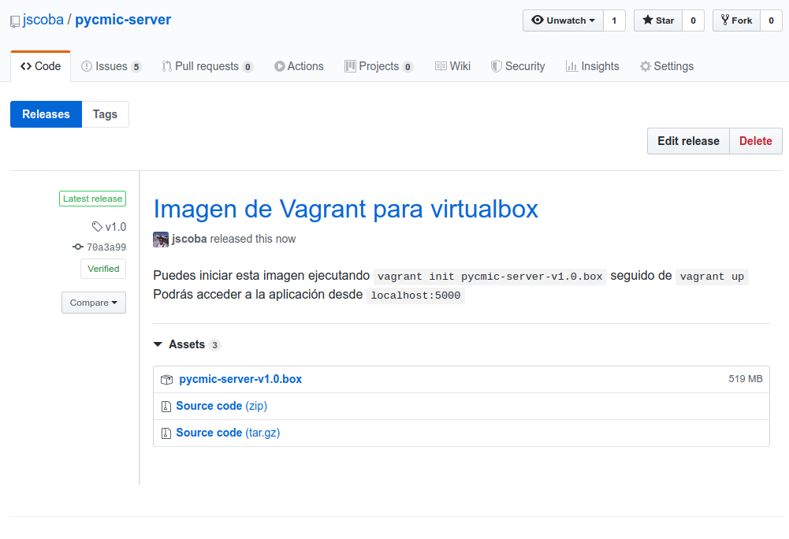

# Pycmic-server - Provisionamiento automático

Vamos a generar los ficheros necesarios para que, partiendo desde un sistema operativo recién instalado (por ejemplo, el de una máquina virtual) podamos instalar y ejecutar nuestra aplicación sin tener que instalar y configurar manualmente todas las herramientas necesarias. Esto es un paso más en el despliegue de nuestra aplicación en la que no tenemos (o no queremos) usar contenedores.

Para poder hacer estas tareas vamos a utilizar ansible. Como referencia para esta configuración hemos utilizado [este post](https://www.kevinlondon.com/2016/09/19/devops-from-scratch-pt-1.html)

Primero vamos a ejecutar todo esto desde una máquina virtual. Para la gestión de las máquinas virtuales vamos a utilizar la herramienta Vagrant. Esta herramienta necesita un fichero de configuración llamado `Vagrantfile`. En su versión más sencilla (crear un máquina simple) se parece a esto:

```ruby
Vagrant.configure(2) do |config|
  # Como base de la máquina vamos a utilizar ubuntu 16.04 LTS
  config.vm.box = "ubuntu/xenial64"

  # Configuración de reenvío de puertos
  config.vm.network "forwarded_port", guest: 5000, host: 5000

  config.vm.provider "virtualbox" do |vb|
    # Asignamos 1GB de RAM a la máquina
    vb.memory = "1024"
  end
end
```

Si ejecutamos `vagrant up` se descargará la imagen de Ubuntu y arrancará la máquina virtual. 

Se ha elegido Ubuntu (versión LTS) como sistema base por su conocida estabilidad y por la familiaridad que supone. Además su sistema `systemd` resulta ideal para mantener la aplicación en ejecución de forma permanente como servicio del sistema.

Podemos acceder a ella ejecutando `vagrant ssh`

Los pasos que tendríamos que seguir para descargar la aplicación y ejecutarla serían los siguientes:

```bash
sudo apt update
sudo apt install git make python3-pip
git clone https://github.com/jscoba/pycmic-server.git
cd pycmic-server
sudo ln -s /usr/bin/pip3 /usr/bin/pip
make install
export PORT=5000
make start_heroku
```

Todos estos pasos podemos automatizarlos usando ansible para realizar el aprovisionamiento de la máquina virtual de forma automática. Primero le decimos a vagrant que use ansible para el aprovisionamiento.

```ruby
  config.vm.provision 'ansible' do |ansible|
    ansible.playbook = 'provision/playbook.yml'
    ansible.verbose = 'v'
  end
```

Y creamos el playbook de ansible que haga todas las tareas que necesitamos:

```yml
- name: Desplegar pycmic-server
  hosts: all
  become: true
  become_method: sudo

  vars:
    repositorio: https://github.com/jscoba/pycmic-server.git
    directorio: /home/vagrant/pycmic-server/

  tasks:
    - name: Instalar paquetes basicos
      apt: update_cache=yes name={{ item }} state=present
      with_items:
        - git
        - make
        - python3-pip
        
    - name: Enlazar pip a pip3
      file:
        src: "/usr/bin/pip3"
        dest: "/usr/bin/pip"
        state: link

    - name: Clonar repositorio
      git: repo='{{ repositorio }}' dest='{{ directorio }}'

    - name: Instalar dependencias
      make:
        chdir: "{{ directorio }}"
        target: install

```

Ahora tenemos que automatizar el arranque de la aplicación. Para esto lo vamos a ejecutar como un servicio del sistema que ejecute el objetivo `start_heroku` (gunicorn) de nuestro Makefile.

Usando el poder de las plantillas de ansible creamos el fichero de configuración para systemd:

```jinja2
[Unit]
Description=Pycmic-server
After=network.target network-online.target
Wants=network-online.target

[Service]
WorkingDirectory={{directorio}}
ExecStart=/usr/bin/make start_heroku PORT=5000
Restart=on-failure
RestartSec=3s

[Install]
WantedBy=multi-user.target
```

Ahora ya podemos decirle a ansible que copie esta configuración a la máquina y ejecute el servicio `pycmic-server`

```yml
    - name: Copiar la configuración del servicio
      template: src=pycmic-server.conf.j2 dest=/etc/systemd/system/pycmic-server.service

    - name: Asegurarnos que el servicio está funcionando
      service: name=pycmic-server state=started
```

Si ahora ejecutamos `vagrant up` automáticamente se creará la máquina virtual y se instalará y ejecutará la aplicación sin tener que hacer nada.



Añadimos un nuevo objetivo al `Makefile` que ejecute la máquina virtual directamente

`make start_vm`

Ahora podemos exportar la máquina virtual para que esté disponible como archivo .box en los releases de github y/o en la vagrant cloud

Para ello ejecutamos `vagrant package` que nos genera un archivo .box

En la interfaz de Vagrant Cloud creamos una nueva box y subimos el archivo



Una vez subido el archivo y liberada la versión ya está disponible en vagrant cloud



Cualquier persona podrá usar esta máquina virtual introduciendo esto en un Vagrantfile

```ruby
Vagrant.configure("2") do |config|
  config.vm.box = "jscoba/pycmic-server"
  config.vm.box_version = "1.0"
end
```

Podemos subir el fichero a github creando una nueva release.

