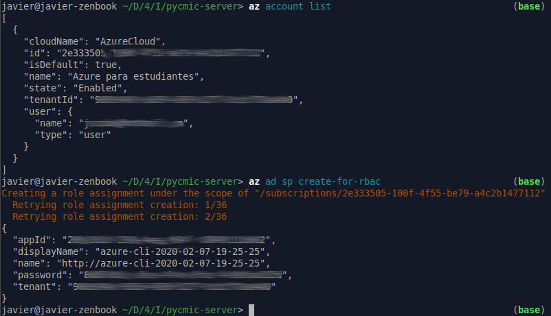
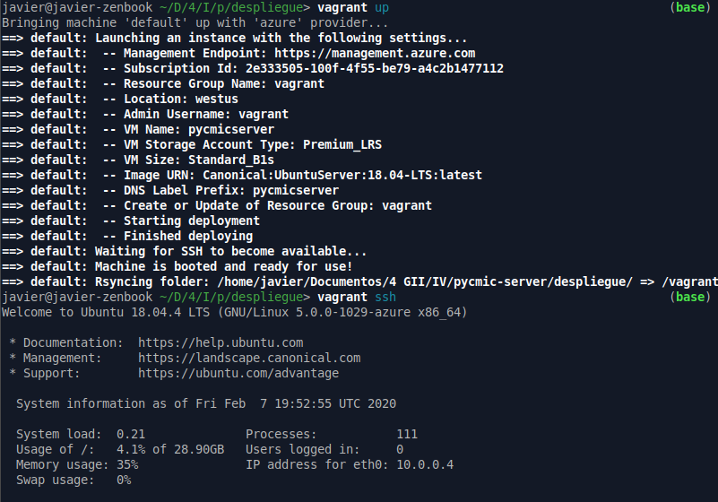
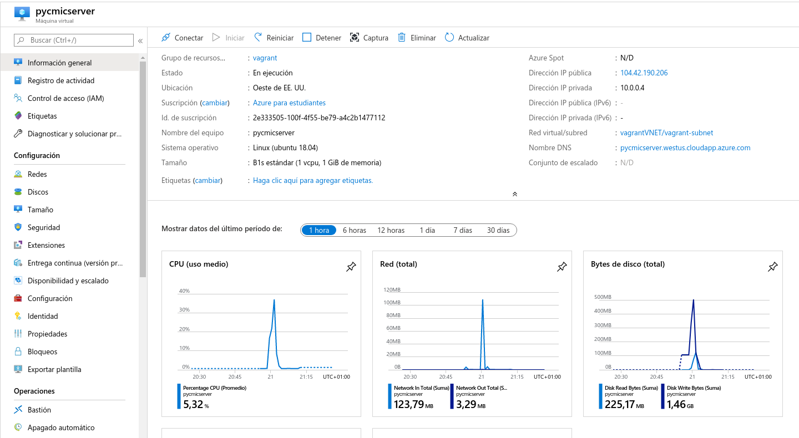
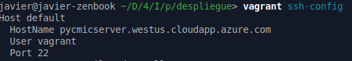

# Pycmic-server - Despliegue en la nube

Vamos a automatizar la gestión de máquinas virtuales de Azure. Para ello vamos a utilizar Vagrant para provisionar la máquina virtual y ansible para hacer la configuración y despliegue. También nos va a hacer falta la CLI de Azure para poder conseguir nuestras credenciales de acceso al servicio.

Como ya usamos Vagrant anteriormente para hacer el despliegue a una máquina local vamos a localizar el nuevo `Vagrantfile` en la carpeta `despliegue/`

Toda la configuración que vamos a hacer aquí está basada en los siguientes recursos: [vagrant-azure](https://github.com/azure/vagrant-azure) y [Using Vagrant with Azure](https://blog.scottlowe.org/2017/12/11/using-vagrant-with-azure/)

Vamos a empezar consiguiendo nuestras claves de azure.

```bash
az login
az ad sp create-for-rbac
```



Una vez tenemos esto podemos crear el Vagrantfile. La configuración de acceso de azure la vamos a poner un archivo externo llamado `.env` que se encuentra junto al Vagrantfile en el directorio `despliegue/` Este archivo tiene la siguiente forma:

```bash
#Rellenar y renombrar como .env
AZURE_TENANT_ID="YOUR_TENTANT_ID"
AZURE_CLIENT_ID="YOUR_APP_ID"
AZURE_CLIENT_SECRET="YOUR_CLIENT_PASS"
AZURE_SUBSCRIPTION_ID="YOUR_SUBSCRIPTION_ID(EL ID DEL PRIMER COMANDO)"
```

Ahora si procedemos al Vagrantfile

```ruby
# Require el provider de Azure
require 'vagrant-azure'
# Require el plugin de variables de entorno
require 'vagrant-env'

# Crear y configurar la máquina virtual
Vagrant.configure('2') do |config|

  # Hay que usar una box dummy que hemos descargado anteriormente
  config.vm.box = 'azure-dummy'

  # Usamos nuestra clave ssh
  config.ssh.private_key_path = '~/.ssh/id_rsa'

  # Configuración de Azure
  config.vm.provider 'azure' do |az, override|
    # Desde el archivo .env sacamos la configuración de Azure
    az.tenant_id = ENV['AZURE_TENANT_ID']
    az.client_id = ENV['AZURE_CLIENT_ID']
    az.client_secret = ENV['AZURE_CLIENT_SECRET']
    az.subscription_id = ENV['AZURE_SUBSCRIPTION_ID']

    # Parametros de la máquina virtual
    az.vm_name = 'pycmicserver'
    az.vm_size = 'Standard_B1s'
    # Imagen base del sistema operativo
    az.vm_image_urn = 'Canonical:UbuntuServer:18.04-LTS:latest'
    az.resource_group_name = 'vagrant'
  end # config.vm.provider 'azure'
end # Vagrant.configure
```

Ahora instalamos los plugins de Vagrant y ejecutamos la máquina virtual

```bash
vagrant box add azure-dummy https://github.com/azure/vagrant-azure/raw/v2.0/dummy.box --provider azure
vagrant plugin install vagrant-azure
vagrant plugin install vagrant-env
vagrant up
```

Con esto la máquina virtual corre en azure y podemos entrar a ella mediante `vagrant ssh`



Ahora tenemos que automatizar la instalación y configuración de nuestra aplicación. Para esto vamos a utilizar ansible con el mismo playbook que usamos anteriormente, por lo que añadimos al Vagrantfile

```ruby
  config.vm.provision 'ansible' do |ansible|
    ansible.playbook = 'playbook.yml'
    ansible.verbose = 'v'
  end
```

Al ejecutar `vagrant provision` ya tenemos la aplicación corriendo en nuestra máquina virtual sobre Azure. Como paso adicional tenemos que permitir que el tráfico entre a esta a través del puerto 5000 (donde se sirve por defecto nuestra aplicación). Para esto añadimos en la configuración de la máquina virtual la siguiente línea

```ruby
az.tcp_endpoints = ['22', '5000'] #Permitir el acceso desde los puertos 22 y 5000
```

Ahora podemos hacer todo el despliegue en la nube de Azure ejecutando `vagrant up`

Cabe destacar que todas las operaciones con Azure tardan unos minutos en realizarse, por lo que hay que ser pacientes.

Una vez que ha terminado la orden ya podemos acceder a la aplicación mediante la IP o el nombre DNS de la máquina. Podemos consultar las estadísticas de nuestra máquina virtual desde el [panel de administración de Azure](portal.azure.com)



Se ha añadido a la herramienta de construcción la opción `azure_up` que permite, una vez copiado manualmente el fichero de entorno con las claves de azure, desplegar la app.

Mediante `vagrant ssh-config` podemos ver la dirección en la que se ha desplegado la aplicación.

